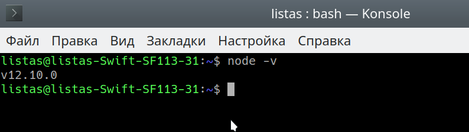

## Веб-программирование
### Лабораторная работа 1

### Лабораторная работа 2
#### Упражнение 2-3

#### Упражнение 9-3
##### [Ссылка на выполненную работу](https://daniillitvochenko.github.io/task9-3/)

## Первый семестр
### Тема 1
#### [XML-документ](https://github.com/DaniilLitvochenko/Portfolio/tree/master/%D0%A2%D0%B5%D0%BC%D0%B0%201/XMLT)
#### [DTD-документ](https://github.com/DaniilLitvochenko/Portfolio/tree/master/%D0%A2%D0%B5%D0%BC%D0%B0%201/DTD)
#### [ВСР](https://github.com/DaniilLitvochenko/Portfolio/tree/master/%D0%A2%D0%B5%D0%BC%D0%B0%201/%D0%92%D0%A1%D0%A0)

### Тема 2
#### [Daemon](https://github.com/DaniilLitvochenko/Portfolio/tree/master/%D0%A2%D0%B5%D0%BC%D0%B0%202/%D0%97%D0%B0%D0%B4%D0%B0%D0%BD%D0%B8%D0%B5%201/Task1)
#### [Часть А. СЛУ](https://kodaktor.ru/?!=0014ff2)
#### [Часть Б. Тернарный оператор](https://kodaktor.ru/?!=ternary_07577)
#### [ИСР](https://github.com/DaniilLitvochenko/Portfolio/tree/master/%D0%A2%D0%B5%D0%BC%D0%B0%202/%D0%98%D0%A1%D0%A0/%D0%97%D0%B0%D0%B4%D0%B0%D0%BD%D0%B8%D0%B5%202)

### Тема 3
#### [Таблица валют](https://github.com/DaniilLitvochenko/Portfolio/tree/master/%D0%A2%D0%B5%D0%BC%D0%B0%203/%D0%97%D0%B0%D0%B4%D0%B0%D0%BD%D0%B8%D0%B5%201/%D0%9A%D1%83%D1%80%D1%81%D1%8B%20%D0%B2%D0%B0%D0%BB%D1%8E%D1%82)
#### [Галерея](https://github.com/DaniilLitvochenko/Portfolio/tree/master/%D0%A2%D0%B5%D0%BC%D0%B0%203/%D0%97%D0%B0%D0%B4%D0%B0%D0%BD%D0%B8%D0%B5%202)
 
### Тема 4
#### [Линтер](https://github.com/DaniilLitvochenko/Portfolio/tree/master/%D0%A2%D0%B5%D0%BC%D0%B0%204/%D0%97%D0%B0%D0%B4%D0%B0%D0%BD%D0%B8%D0%B5%201/linter)

## Второй семестр
### Тема 1
#### [Миксер цветов(Кодактор)](https://kodaktor.ru/?!=color_f781c)
#### [Миксер цветов(Репозиторий)](https://github.com/DaniilLitvochenko/Portfolio/tree/master/2%20%D1%81%D0%B5%D0%BC.%20%D0%A2%D0%B5%D0%BC%D0%B0%201/%D0%97%D0%B0%D0%B4%D0%B0%D0%BD%D0%B8%D0%B5%201)
#### [Магазин](https://github.com/DaniilLitvochenko/Portfolio/tree/master/2%20%D1%81%D0%B5%D0%BC.%20%D0%A2%D0%B5%D0%BC%D0%B0%201/%D0%97%D0%B0%D0%B4%D0%B0%D0%BD%D0%B8%D0%B5%202/Store)
#### [Магазин(GitHub Pages)](https://daniillitvochenko.github.io/store/)

### Тема 2
#### [Canvas инициалы(Кодактор)](https://kodaktor.ru/click_cc265)
#### [Canvas инициалы(Репозиторий)](https://github.com/DaniilLitvochenko/Portfolio/tree/master/2%20%D1%81%D0%B5%D0%BC.%20%D0%A2%D0%B5%D0%BC%D0%B0%202/%D0%97%D0%B0%D0%B4%D0%B0%D0%BD%D0%B8%D0%B5%201)
#### [Canvas смена изображения(Кодактор)](https://kodaktor.ru/1b0dc8d)
#### [Canvas смена изображения(Репозиторий)](https://github.com/DaniilLitvochenko/Portfolio/tree/master/2%20%D1%81%D0%B5%D0%BC.%20%D0%A2%D0%B5%D0%BC%D0%B0%202/%D0%97%D0%B0%D0%B4%D0%B0%D0%BD%D0%B8%D0%B5%202)
 
### Тема 3
#### [График валют(Кодактор)](https://kodaktor.ru/canvas_ec8f0)
